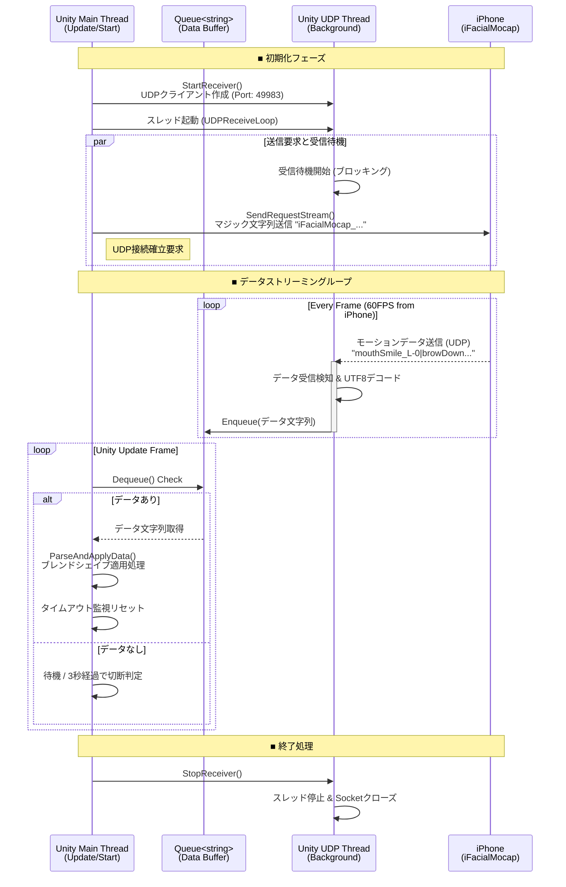

### 1\. ロジックフロー図 (Mermaid)

この図は、Unity（メインスレッド・UDPスレッド）と iPhone (iFacialMocap) 間の通信とデータ処理の流れを表しています。

-----

### 2\. ロジックの詳細解説

コードは大きく分けて「ネットワーク通信（別スレッド）」と「データ適用（メインスレッド）」の2つの役割で構成されています。

#### A. 接続の確立 (Single Socket Architecture)

ドキュメントにある通り、iFacialMocapはUDPでデータを受け取るために、PC側から特定の文字列（マジックストリング）を送る必要があります。

  * **特徴的な実装:** 通常、送信と受信で別のソケットを使うことが多いですが、このコードでは **1つの `UdpClient` インスタンス** で送受信を行っています。
      * `udpClient = new UdpClient(receivePort);` で受信ポート（49983）をバインドします。
      * その同じクライアントを使って `SendRequestStream()` でiPhoneへデータを送ります。
      * **メリット:** これにより、ルーターやファイアウォールに対して「このポートで通信を行っている」というNATホールの維持がしやすくなり、接続成功率が高まります。

#### B. 受信スレッド (Producer)

Unityのメインループを止めないために、`Thread` を使ってバックグラウンドで受信を行います。

1.  **ブロッキング受信:** `udpClient.Receive(ref remoteEP)` はデータが来るまで処理を停止（ブロック）します。
2.  **タイムアウト設定:** `ReceiveTimeout = 1000` (1秒) が設定されており、データが来ない場合は例外 (`SocketError.TimedOut`) が発生します。これにより、無限に待ち続けてスレッドが固まるのを防いでいます。
3.  **キューへの格納:** 受信したバイトデータをUTF-8文字列に変換し、`incomingQueue` に格納（Enqueue）します。ここで `lock (queueLock)` を使い、メインスレッドとの競合を防いでいます（排他制御）。

#### C. メインスレッドでの処理 (Consumer)

Unityの `Update()` 関数内で毎フレーム実行されます。

1.  **キューの処理:** `incomingQueue` からデータを取り出し（Dequeue）、文字列として取得します。
2.  **データの解析:** 取り出した文字列（例: `mouthSmile_L-0|head#-1.5...`）を解析関数 `ParseAndApplyData` に渡します。
      * **仕様:** ドキュメントにある通り、データは `|` (パイプ) で区切られています。
      * **実装:** 現在のコードでは解析の中身は省略されていますが、ここで `Split('|')` などを行い、Unityのアバター（SkinnedMeshRenderer）に値を適用する想定です。
3.  **接続監視 (Keep-Alive):**
      * データを受信するたびに `lastReceiveInfo` の時間を更新します。
      * もし最終受信から **3秒以上** 経過した場合、通信断絶とみなして `isConnected = false` にします。

#### D. ドキュメントとの整合性

  * **マジックストリング:** コード内の `udpMagic` 定数は、ドキュメントに記載されている `iFacialMocap_sahuasouryya9218sauhuiayeta91555dy3719` と完全に一致しています。
  * **ポート番号:** ドキュメント記載の標準ポート `49983` をデフォルト値として使用しています。

### まとめ

このコードは、iFacialMocapの仕様（UDPマジックストリングによる開始トリガー、パイプ区切りのデータ形式）に準拠しつつ、**スレッドセーフなキューイング**と**単一ソケットによる安定接続**を実現した堅実な実装となっています。